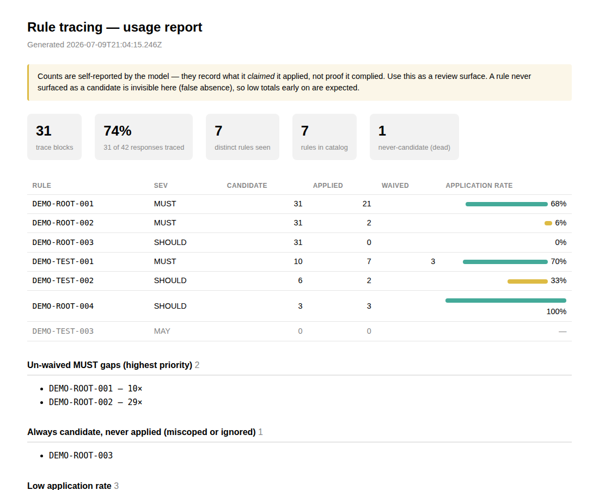

# rule-trace

[](https://www.skills.sh/seanleecoder/rule-trace)

See which agent rules actually shaped the work.

**Today:** every substantive agent response ends with a clickable, reviewable trace — which rules were candidates, which shaped the work, and why any rule was waived — instead of trusting "the agent followed project rules" as an unverifiable claim.

**Over weeks:** the counters turn those traces into maintenance signal — which rules are dead, which are always loaded but never applied, and which `MUST` rules keep getting silently skipped.

`CLAUDE.md`, `AGENTS.md`, `.cursorrules`, and tool configs are easy to grow and hard to debug. After a few weeks, you usually cannot tell which instructions are still useful, which ones are noise, or whether Claude, OpenCode, Codex, Cursor, and other tools are even loading the same rules.

`rule-trace` turns agent rules into a reviewable loop:

1. Migrate prose rules into stable, citable IDs.
2. Ask agents to disclose which rules were candidates, applied, or deliberately skipped.
3. Validate that the catalog, rule files, and importers have not drifted.
4. Report usage so dead, broad, skipped, or stale rules become visible.

Rules loaded into a coding agent are *loaded* context, not *applied* context. A rule that was followed looks identical to one that was ignored unless the agent makes the difference visible. This skill closes that gap with stable rule IDs, trace blocks, a deterministic validator, and cross-session usage reports.

Background: [Making AI-agent rule application visible - stable IDs and trace blocks](https://seanleecoder.hashnode.dev/making-ai-agent-rule-application-visible-stable-ids-and-trace-blocks).



## Why Use It

Use this when your agent rules have become important enough to break things, but still invisible enough that no one can inspect them.

- Give reviewers a concrete trace instead of "the agent followed project rules" as an unverifiable claim.
- Find rules that are never candidates and should be removed, narrowed, or rewritten.
- Find rules that are always candidates but rarely applied, usually a sign they are too broad, too expensive, or miscoped.
- Catch `MUST` rules that were in scope but neither applied nor explicitly waived.
- Fail CI when a catalog ID no longer resolves to a heading, a rule is missing required fields, an importer drifts, or `.opencode/opencode.json` is malformed.
- Keep supported importer entry points referencing the same canonical rule files when a repo uses more than one agent tool; see the importer support matrix for which tools actually expand references.

This repository dogfoods rule-trace: `.agents/` contains the live migrated rule set, while `CLAUDE.md` and `AGENTS.md` show the thin-importer end state — though per the importer support matrix in [`importer-wiring.md`](skills/rule-trace/references/importer-wiring.md), this repo's own root `AGENTS.md` uses `@`-imports whose expansion is unconfirmed for Codex CLI. See `examples/demo/` for seeded metrics and a generated dashboard.

This is not compliance theater. Counts are self-reported by the model, so they are an audit signal, not proof. The value is that previously invisible rule behavior becomes reviewable.

## Core Workflow

Most teams should start with the core loop:

1. **Migrate** existing prose from `CLAUDE.md`, `AGENTS.md`, `.cursorrules`, package READMEs, and docs into ID-based rules.
2. **Validate** the rule system so every catalog entry resolves, every rule has required fields, and configured importers load the same file set.
3. **Collect** trace blocks from saved transcripts or a live Claude Code hook.
4. **Report** candidate/applied/deviation counts into `.agents/metrics/report.json` and an optional `dashboard.html`.


| Workflow step | Who runs it | How |
| --- | --- | --- |
| Migrate / Init / Audit | agent (skill mode) | ask your agent |
| Validate | CLI or CI | `rule-trace validate` |
| Collect | CLI or Stop hook | `rule-trace collect` / hook |
| Report | CLI | `rule-trace report` |

The skill also supports `init` for new repos and `audit` for cleanup after you have enough usage data, but `migrate -> validate -> collect -> report` is the main release path. Do not skip collect: `report` only aggregates traces that already exist, so a report run before any traces are collected flags every catalogued rule as dead.

## Before And After

Before, rules are usually prose in one or more importer files:

```md
# CLAUDE.md

Always use pnpm, not npm.
Run relevant tests before finishing.
Keep agent importers in sync.
```

After migration, each enforceable rule gets a stable ID and a trigger:

```md
## ROOT-001

- Scope: repository
- Applies when: installing dependencies or running package scripts
- Severity: MUST
- Rule: Use pnpm, not npm.

## TEST-001

- Scope: tests
- Applies when: changing runtime behavior
- Severity: SHOULD
- Rule: Run the relevant tests before finishing.
```

An agent response can then disclose what mattered; the prose is for reviewers, and the fenced `rule-trace` JSON is the machine-stable data layer:

````md
Rule trace

- Candidate rules loaded: [`ROOT-001`](rules/root.md), [`TEST-001`](rules/testing.md)
- Rules applied: [`ROOT-001`](rules/root.md)
- Sources: [`.agents/rules/root.md`](rules/root.md), [`.agents/rules/testing.md`](rules/testing.md)
- Reasoning note: dependency commands were involved, but the change was docs-only.
- Deviations: [`TEST-001`](rules/testing.md) - docs-only change; no runtime behavior changed.

```rule-trace
{"v":1,"candidate":["ROOT-001","TEST-001"],"applied":["ROOT-001"],"deviations":["TEST-001"]}
```
````

Across sessions, the report turns those traces into maintenance signal:

```text
TEST-001: candidate 42x, applied 8x, waived 20x
```

That does not prove the agent was right. It tells you `TEST-001` is worth reviewing: maybe the trigger is too broad, maybe the rule is too expensive, or maybe the team is repeatedly waiving something it claims to care about.

## What You Get

Core pieces:

- **Stable rule IDs** anchored at markdown `##` headings.
- **A catalog** (`.agents/rules-catalog.md`) that indexes every rule ID and source file.
- **Trace blocks** that distinguish candidate rules, applied rules, and deliberate deviations.
- **A validator** that is deterministic, dependency-free, CI-friendly, and runnable without an agent runtime.
- **Usage reports** that aggregate traces across sessions into candidate/applied/rate metrics.

Optional adoption support:

- **Thin importers** for tools that support file references, plus documented/generated native formats for the tools that don't — see the importer support matrix for which is which.
- **A dashboard** that flags dead rules, always-candidate-never-applied rules, low application rate, un-waived `MUST` gaps, and unknown IDs.
- **CI snippets** for GitHub Actions and GitLab.
- **A Claude Code Stop hook** for live usage collection.
- **Scaffolding** for optional CI, hook, and metrics wiring.
- **Audit mode** for cleaning up rule sets after reports have useful volume.

## Install

Pick **one** path for Claude Code — skills.sh and the plugin install the same skill, so they are alternatives, not steps. Combining them wires the live `Stop` hook twice (see the note below).

### Path A — skills.sh (all agents; recommended for teams)

```bash
npx skills add seanleecoder/rule-trace
```

Installs into every detected agent at once — Claude Code under `.claude/skills/`, OpenCode/Codex/Cursor under `.agents/skills/` — as files in your repo tree that you can **commit**, so teammates get it on clone. Add `-g` for a global install, or `--copy` to copy instead of symlink. Update later with `npx skills update rule-trace`. For live counting on Claude Code, wire the `Stop` hook by hand (one snippet — see [`skills/rule-trace/references/importer-wiring.md`](skills/rule-trace/references/importer-wiring.md)).

### Path B — Claude Code plugin (Claude Code only; hook auto-wired)

```text
/plugin marketplace add seanleecoder/rule-trace
/plugin install rule-trace@seanleecoder-skills
```

Installs the same skill for Claude Code only, per developer (under `~/.claude/plugins/`, _not_ committed to the repo), and ships a `Stop` hook in [`hooks/hooks.json`](hooks/hooks.json) that is wired automatically — nothing else to do for live counting.

> **Don't combine A and B.** Both wire the recorder. The plugin's command resolves to `${CLAUDE_PLUGIN_ROOT}/…` and the manual one to `$CLAUDE_PROJECT_DIR/…`, so Claude Code can't dedupe them and the recorder runs on every turn from each. It fails _silently_ — `record-trace.mjs` dedupes by message UUID, so the second run just writes nothing — but it spawns a redundant process per turn. Use skills.sh **plus** the manual hook, _or_ the plugin alone. `validate` and `scaffold` warn if they detect both.

For CI-only validation, use the package CLI without an agent runtime:

```bash
npx rule-trace@1 validate
```

## Quickstart

Once installed, ask your agent to migrate an existing repo:

```text
use rule-trace to migrate this repo's rules
```

Useful starting points:

- **Existing rules:** ask for `migrate`. The agent gathers `CLAUDE.md`, `AGENTS.md`, `.cursorrules`, `.opencode/opencode.json`, package READMEs, and any docs you point it at, then splits prose into ID-based rules.
- **No existing system:** ask for `init`. The agent creates `.agents/rule-trace.md`, `.agents/rules-catalog.md`, an example `.agents/rules/root.md`, and optional thin importers.
- **Just validate:** run `rule-trace validate` or `node <skill>/scripts/validate-rules.mjs` from the target repo root.
- **Verify it is working:** after migrate, ask a rule-shaped question such as `Which tests would matter if I changed the validator?`; a substantive response should end with `Rule trace`. If the live hook is wired, confirm `.agents/metrics/traces.jsonl` gained a line. Or try the committed demo first: `node <skill>/scripts/report.mjs --root examples/demo`.
- **Just count usage:** run `collect` to backfill traces from transcripts, then `report` to build the report and dashboard.
- **Ready to clean up:** after you have enough trace data, ask for `audit` to classify rules as keep, revise, remove, consolidate, or add.

## Commands

The deterministic scripts are available directly:

```bash
# Validate the rule system.
node <skill>/scripts/validate-rules.mjs --root <repo>

# Backfill trace events from saved transcripts.
node <skill>/scripts/parse-traces.mjs --root <repo> --transcripts <dir>

# Build .agents/metrics/report.json and dashboard.html.
node <skill>/scripts/report.mjs --root <repo> --low-rate 0.5 --min-candidates 3 --min-coverage 0.2 --stale-days 30 --since 2026-01-01

# Generate the catalog from rule headings, preserving curated summaries.
node <skill>/scripts/generate-catalog.mjs --root <repo> --write

# Materialize generated importers for reference-blind tools such as Cursor/Copilot.
node <skill>/scripts/sync-importers.mjs --root <repo> --check
```

The CLI exposes the same core tools:

```bash
npx rule-trace@1 <validate|collect|report|catalog|scaffold|sync>
# Pre-registry fallback (unpinned — prefer the registry):
npx github:seanleecoder/rule-trace validate
```

## Counters And Dashboard

Trace blocks carry candidate and applied IDs in human-readable prose plus a fenced `rule-trace` JSON block, so the data exists in transcripts even if future model wording drifts. The collectors append events into one UUID-deduped log at `.agents/metrics/traces.jsonl`.

- **Offline collection/backfill:** `parse-traces.mjs` scans saved transcripts and appends trace blocks. It is re-runnable and tool-agnostic when the transcript records expose a UUID and assistant text.
- **Live Claude Code hook:** `record-trace.mjs` records each finished main-agent response from a Claude Code `Stop` hook. The plugin wires this automatically; skills.sh and standalone installs can add the hook manually from `references/importer-wiring.md`.

`report.mjs` writes `.agents/metrics/report.json` and `.agents/metrics/dashboard.html`. Tune noisy repos with `--low-rate <0..1>`, `--min-candidates <n>`, `--min-coverage <0..1>`, `--stale-days <n>`, and `--since <ISO-8601 date>`. Pass `--now <ISO-8601 date>` to pin report time for reproducible runs (staleness and `generatedAt` both derive from it).

The live hook also records finished main-agent responses that omit a trace block, letting the report show trace coverage and warn when coverage is too low to trust dead-rule or low-rate conclusions. Trivial or conversational responses may intentionally omit traces, so 100% coverage is not the target; coverage is a sanity and trend signal.

The dashboard highlights:

- `deadRules` - catalogued rules that were never candidates.
- `alwaysCandidateNeverApplied` - rules that came up but never constrained the work.
- `lowRate` - rules below the configured application-rate threshold.
- `unwaivedMustGaps` - `MUST` rules that were candidates but neither applied nor waived.
- `stale` - rules that were candidates before but have not surfaced within the configured staleness window.
- `unknownIds` - hallucinated or stale IDs cited by traces.


## Stability

Semver covers the public contract teams build around: the trace-block convention (including the prose labels and fenced `rule-trace` JSON format), the rule anatomy and rule-ID grammar, event JSONL fields, `.agents/rule-trace.config.json` keys, CLI command names and documented flags, and validator exit-code semantics.

Semver does not cover internal script file paths or repository layout, dashboard HTML/CSS details, exact console-output wording, or `report.json` field ordering.

## What It Costs

A trace block is roughly 50–100 tokens on substantive responses. Rule files usually replace prose the agent entry points were already loading, so migration is roughly context-neutral; `.agents/rule-trace.md` adds a few hundred tokens once per session. The live Claude Code Stop hook is a local subprocess per turn and is designed never to block the agent. Treat these as rough orders of magnitude, not benchmarks.

## Validation And CI

`validate-rules.mjs` fails on rule-system errors and exits `1`:

- Catalog IDs that no longer resolve to `## ID` headings.
- Rule headings missing from the catalog.
- Duplicate rule IDs.
- Missing required fields: `Scope`, `Applies when`, `Severity`, and `Rule`.
- Invalid severity values outside `MUST`, `SHOULD`, and `MAY`.
- Importer drift, where configured agent tools load different rule file sets.
- Malformed OpenCode config when `.opencode/opencode.json` is present.
- Trace blocks that cite IDs missing from the catalog when using `--lint-file <path>`.

It warns, but does not fail, when configured importers are absent or numbered IDs have gaps. If a gap is intentional because a rule was retired, add that ID to `retiredIds` in `.agents/rule-trace.config.json` so validation treats the gap as documented retirement rather than drift. If a repo intentionally uses only one agent tool, set `importers` in `.agents/rule-trace.config.json` to just that entry so validation stays quiet.

Example package script:

```json
{
  "scripts": {
    "rules:validate": "node .agents/skills/rule-trace/scripts/validate-rules.mjs"
  }
}
```

More CI snippets live in `skills/rule-trace/references/ci-wiring.md`.

## Optional Scaffolding

`scaffold-wiring.mjs` writes optional operational glue. It is non-destructive: existing files are left untouched, and merge instructions are printed when manual integration is needed.

```bash
node <skill>/scripts/scaffold-wiring.mjs --root <repo> --all
node <skill>/scripts/scaffold-wiring.mjs --root <repo> --hook
node <skill>/scripts/scaffold-wiring.mjs --root <repo> --gitignore
node <skill>/scripts/scaffold-wiring.mjs --root <repo> --ci github
node <skill>/scripts/scaffold-wiring.mjs --root <repo> --ci gitlab
node <skill>/scripts/scaffold-wiring.mjs --root <repo> --ci none
```

With no selector flags, `--all` is assumed. Selective flags do only what they say: `--hook` does not create CI, and `--gitignore` does not create a hook.

## Tests And Evals

The repo includes deterministic tests for the scripts, manifests, docs, and regression cases:

```bash
npm test
```

Behavioral evals exercise the agent-driven `migrate` mode on fixture repos:

```bash
node evals/run.mjs
node evals/run.mjs --exec --fixtures single-claude-md,oss
node evals/run.mjs --exec --agent codex --fixtures single-claude-md,oss
node evals/run.mjs --exec --agent codex --codex-sandbox danger-full-access --fixtures single-claude-md
node evals/run.mjs --grade-only
```

The runner prints the source fixture and generated arm directories after each round so you can inspect or diff before/after outputs. See [`evals/README.md`](evals/README.md) for the eval workflow and `fetch-oss.mjs` for adding a real public-repo fixture.

## Limits

Rule traces are self-reported. They tell you what the model claimed was in scope and applied; they do not prove the model complied. Treat the report as a review surface.

A rule that never appears as a candidate is invisible to the counters, so early reports with low volume are directional. The first useful result is often not a perfect score; it is a short list of rules worth deleting, narrowing, or rewriting.

## License

MIT (c) Sean Lee ([seanleecoder](https://github.com/seanleecoder))
